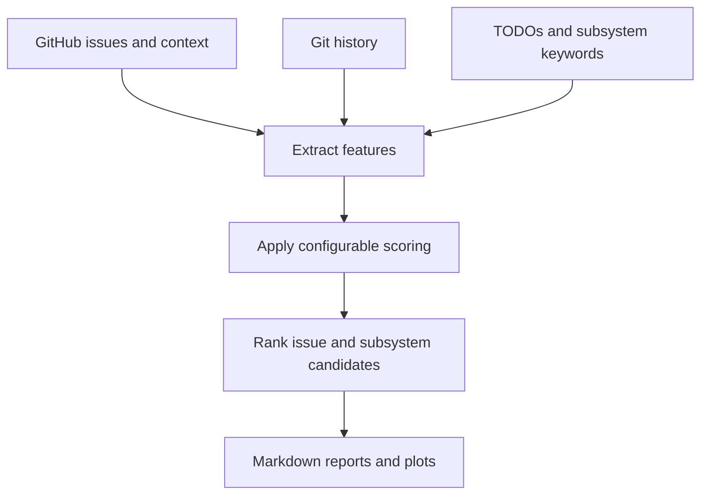

# contrib-intel

`contrib-intel` ranks possible open-source contribution areas in a large repository.

It combines open GitHub issues, issue discussion and cross-references, source-code
signals, and Git history. The result is a Markdown report of concrete issues and
subsystems worth inspecting manually.

This is a heuristic decision-support tool. It is **not a machine-learning model**
and it does not decide whether an issue is suitable or unclaimed.

## Problem

Large repositories can have thousands of issues and years of history. Labels such
as `good first issue` help, but they do not answer questions such as:

- Is somebody already working on this issue?
- Has a maintainer suggested a direction?
- Which source files are probably relevant?
- Is this subsystem active, bug-prone, or full of deferred work?
- Which opportunities match the contributor's interests?

`contrib-intel` turns those signals into a reproducible shortlist for human review.

## Pipeline



The repository-specific vocabulary, filters, weights, and paths live in
`configs/*.yaml`. The same Python pipeline can therefore inspect Scala, Haskell,
or Agda repositories without hard-coding their directory structure.

## Scoring

There are two related rankings.

### Individual issue score

For each issue, the tool:

1. counts configured subsystem-keyword occurrences in its title, body, and labels;
2. adds bonuses for references from other repositories;
3. adds bonuses when configured maintainers use a configured hint phrase;
4. adds a dormant-issue bonus;
5. subtracts a penalty when a same-repository pull request already references it.

In simplified form:

```text
issue score = keyword matches
            + external references × external-reference bonus
            + maintainer hints × maintainer-hint bonus
            + dormant bonus
            - same-repository PRs × active-work penalty
```

### Subsystem-cluster score

A cluster combines:

- number of matching issues;
- keyword signals in its five highest-signal files;
- total file churn;
- bug-fix-related churn;
- selected TODO/FIXME signals;
- issue-context bonuses and penalties;
- an optional personal-interest bonus.

All weights are configurable in the YAML files. A score is a **relative
priority signal**, not a probability or a measure of issue difficulty. Raw keyword
frequency can dominate a result, so always inspect the issue and recent
repo activity on your own.

## Example output

From the checked-in `reports/scala3-opportunities.md`:

```text
Top concrete issue candidates:

- #24776 Crash in experimental macro annotation adding a definition to ClassDef
  (subsystem: typer, score: 324.0) — inspect manually
- #25204 no owner from <none>/<none> in emb.apply
  (subsystem: typer, score: 265.0) — inspect manually
- #24719 Assertion failure in LazyAnnotation.tree
  (subsystem: typer, score: 245.0) — inspect manually
```

The full report also includes issue clusters, likely files, linked pull requests,
external references, maintainer hints, dormant days, and churn/test-investment
targets.

## Setup

Requirements: Python 3.10+, Git, and a local checkout of the repository to inspect.

```bash
git clone https://github.com/dancewithheart/contrib-intel.git
cd contrib-intel
python3 -m venv .venv
source .venv/bin/activate
python -m pip install --upgrade pip
python -m pip install -e ".[analysis,dev]"
```

Clone the target repository and set `paths.local_repo` in the selected config. For
example, `configs/scala3.yaml` currently expects `~/scala3`.

GitHub allows unauthenticated requests, but a token raises the API rate limit:

```bash
export GITHUB_TOKEN=your_token
```

## Run

One command fetches/caches GitHub data, scans the local checkout, ranks candidates,
builds the opportunity report, and creates the pandas analysis report and plots:

```bash
./go.sh scala3 --refresh
```

Omit `--refresh` to reuse cached GitHub responses:

```bash
./go.sh scala3
```

Generated files:

- `reports/scala3-opportunities.md`
- `reports/scala3-analysis.md`
- `reports/assets/scala3/subsystem-counts.png`
- `reports/assets/scala3/issue-and-score-distributions.png`
- `reports/assets/scala3/churn-vs-bugfix.png`

To print 5–10 lines of actual generated candidate output:

```bash
sed -n '/Top concrete issue candidates:/,+9p' reports/scala3-opportunities.md
```

To inspect a slightly larger generated section:

```bash
sed -n '1,35p' reports/scala3-opportunities.md
```

## Architecture

| File | Responsibility |
| --- | --- |
| `configs/*.yaml` | Repository paths, vocabulary, filters, and scoring weights |
| `scripts/fetch_github_issues.py` | Fetch open issues and pull requests through the GitHub API |
| `scripts/fetch_issue_context.py` | Fetch issue comments and timeline/cross-reference events |
| `scripts/scan_repo_signals.py` | Scan tracked text files for TODOs and subsystem keywords |
| `scripts/mine_git_history.py` | Measure file churn and bug-fix-related churn from Git history |
| `scripts/rank_candidates.py` | Build issue, cluster, topic, and churn rankings |
| `scripts/build_report.py` | Render the opportunity report |
| `scripts/analyze_data.py` | Build pandas summaries and matplotlib plots |
| `tests/` | Unit tests for parsing, filtering, ranking, and report generation |

Intermediate CSV and JSON files are written under `data/<repo>/`. They make each
stage inspectable and allow the GitHub responses to be cached.

## Development

```bash
pytest -q
ruff check .
mypy scripts
```

## Limitations

- Ranking is heuristic and repository-specific; it is not ML.
- Keyword counts do not understand semantics and may over-rank repeated terms.
- Commit-subject keywords are only a proxy for bug-fix churn.
- Maintainer detection depends on manually configured handles and phrases.
- GitHub cross-references can be incomplete, and cached data becomes stale.
- A high score does not mean an issue is easy, unclaimed, accepted, or aligned with
  the maintainers' current priorities.
- The final step must remain human: read the issue, search recent pull requests,
  reproduce the problem, and discuss the intended change when appropriate.

## License

No license has been added yet. Add one before inviting outside contributions or
redistribution.
