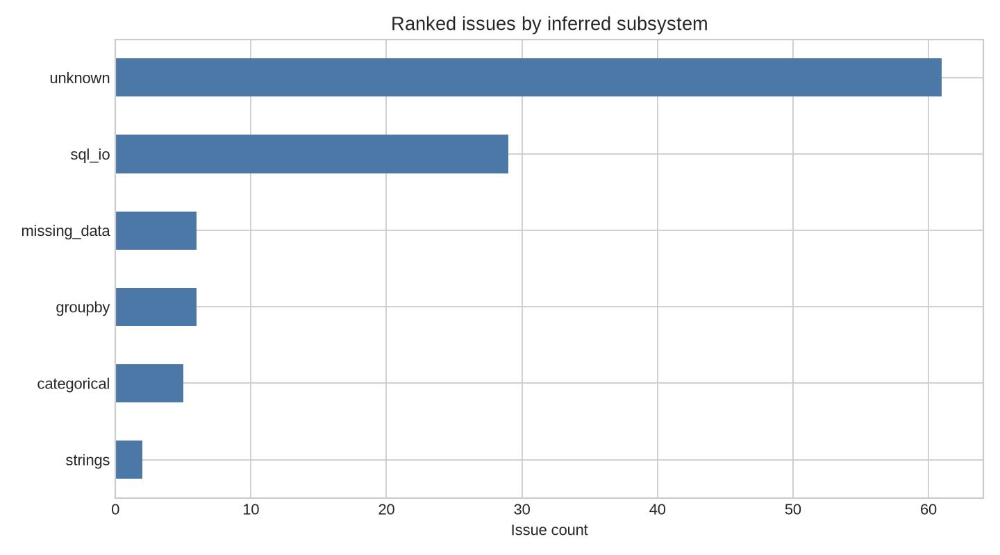
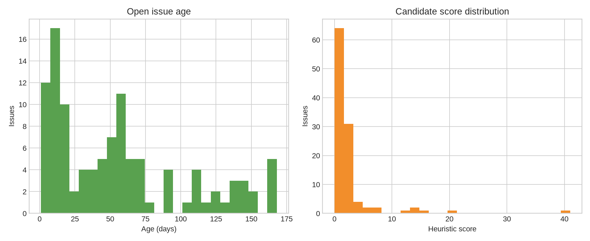
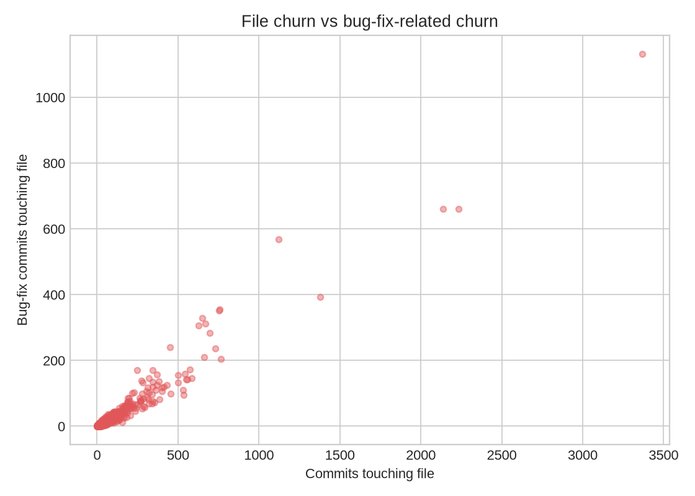

# pandas data analysis

This report summarizes the intermediate data produced by `contrib-intel`.
Candidate scores are heuristic ranking signals, not probabilities.

## Dataset

- open issues: **109**
- ranked candidates: **109**
- files with churn data: **2,769**

## Subsystem counts

| subsystem | issue_count |
| --- | --- |
| unknown | 61 |
| sql_io | 29 |
| missing_data | 6 |
| groupby | 6 |
| categorical | 5 |
| strings | 2 |

## Issue age and candidate scores

| statistic | local_score | dormant_days |
| --- | --- | --- |
| count | 109.0 | 109.0 |
| mean | 2.09 | 26.76 |
| std | 5.09 | 36.41 |
| min | 0.0 | 0.0 |
| 25% | 0.0 | 7.0 |
| 50% | 0.0 | 11.0 |
| 75% | 2.0 | 30.0 |
| max | 41.0 | 165.0 |

## Churn relationship

Pearson correlation between total file churn and bug-fix-related churn: **0.974**.

This correlation is descriptive. Commit-subject matching is a proxy and does not establish that churn causes defects.

## Top candidates

| number | title | subsystem | local_score | recommendation |
| --- | --- | --- | --- | --- |
| 66688 | API: astype to CategoricalDtype matches by lookup instead of casting, so legitimate casts  | categorical | 41.0 | inspect manually |
| 66626 | NumPy/object fallbacks in Arrow-backed arrays | groupby | 20.0 | inspect manually |
| 67014 | API: Restrictions on EA scalar types | missing_data | 16.0 | inspect manually |
| 66382 | BUG: read_csv(dtype="category") ignores dtype_backend for the c and python engines | categorical | 14.0 | inspect manually |
| 65419 | BUG: Index.get_indexer matches pd.NA against NaN for list input but not ndarray input | missing_data | 14.0 | inspect manually |
| 67024 | BUG: `Series.str.extract` with `ArrowDtype` raises on unnamed capture groups, and drops th | strings | 13.0 | inspect manually |
| 67064 | DOC: user guide SQL section lacks PostgreSQL (psycopg 3) recipes | sql_io | 8.0 | inspect manually |
| 68433 | ENH: move the postgresql extra from psycopg2 to psycopg 3 | sql_io | 7.0 | inspect manually |
| 68703 | API: select_dtypes | categorical | 5.0 | inspect manually |
| 67065 | BUG: HDFStore.select with where="cat == None" returns empty DataFrame for Categorical colu | categorical | 5.0 | inspect manually |
